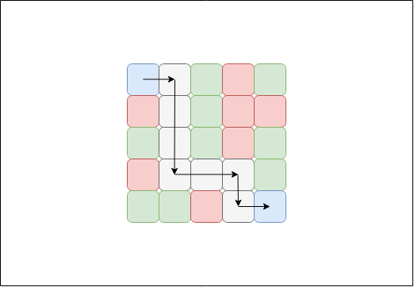

# find path between 2 dots
Given a 2D array(m x n). The task is to check if there is any path from top left to bottom right. In the matrix, -1 is considered as blockage (can’t go through this cell) and 0 is considered path cell (can go through it).
Note: Top left cell always contains 0
Example:
```
Input : arr[][] = { { 0, 0, 0, -1, 0},
                    {-1, 0, 0, -1, -1},
                    { 0, 0, 0, -1, 0},
                    {-1, 0, 0, 0, 0},
                    { 0, 0, -1, 0, 0}}
Output : Yes
```


